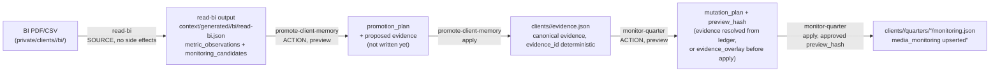

# Workflow: BI → evidence → Quarter monitoring

The one fully implemented, fully tested end-to-end flow today. Everything
here is real (`read-bi`, `promote-client-memory`, `monitor-quarter` are
all `implemented: true` in `skills/registry.json`).

## Step by step

1. **`read-bi`** (SOURCE) reads a BI export. PDFs are visual-first — a
   dashboard screenshot is rendered and read visually, never OCR'd or
   trusted from `pdftotext` alone; CSVs are parser-driven. Output:
   `metric_observations` (every number seen, with `observation_id`,
   `confidence`, source reference) and `monitoring_candidates` (the
   subset eligible to become a Quarter media actual — explicit channel,
   unambiguous month, explicit spend).
2. **`promote-client-memory`** (ACTION), `mode: preview`: takes the
   eligible observation, computes its deterministic `evidence_id`
   (`scripts/lib/evidence_id.py`), and proposes it for
   `clients/<id>/evidence.json` — nothing written yet.
3. **`promote-client-memory`**, `mode: apply` (only on explicit request):
   writes the evidence to the canonical ledger, validated against
   `schemas/client-evidence.schema.json`.
4. **`monitor-quarter`** (ACTION), `mode: preview`: builds an
   `upsert_media_actual` operation referencing that `evidence_id`. If
   the evidence isn't in the canonical ledger yet (step 3 hasn't
   happened), it can still preview using `evidence_overlay` — see
   `operation/quarter-rules.md` and `skills/monitor-quarter/SKILL.md`
   section 5.1. This is what closes the `ATOMIC_PREVIEW_GAP`.
5. **`monitor-quarter`**, `mode: apply` (only with the approved
   `preview_hash`, and only when the evidence is now physically in the
   canonical ledger — `evidence_overlay` is never consulted in apply):
   writes `attainment_percent`/`variance_value` (computed from
   `plan.json`'s `planned_budget`, never redefining the plan) into
   `monitoring.json`.

See `operation/evidence-authority.md` and `operation/quarter-rules.md`
for the underlying policy, and
`tests/integration/test_bi_to_quarter_synthetic.py` for this exact flow
executed end-to-end on synthetic data (idempotent replay included).
