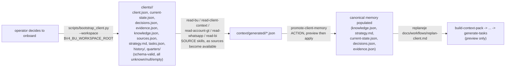

# Workflow: onboarding a new client

Implemented end to end: `scripts/bootstrap_client.py` + `templates/client/`
through the full replanning pipeline (see `skills/registry.json` —
only `publish-ekyte` remains `planned`).



## Step 1 — scaffold (implemented)

```bash
python scripts/bootstrap_client.py acme --workspace "$V4_BU_WORKSPACE_ROOT"
```

Every generated file comes verbatim from `templates/client/`
(schema-valid, `unknown`/`null`/`[]`/`{}` only — see CLAUDE.md section 6,
never invented commercial data). Re-running with `--force` only fills in
files that are missing or byte-identical to the template; anything a
human or a previous promotion already customized is left untouched — see
`scripts/bootstrap_client.py`'s docstring and
`tests/skills/` for the protection test.

## Step 2 — feed sources (implemented, per-source)

Run whichever SOURCE skills apply to this client
(`read-bu`, `read-client-context`, `read-account-gt`, `read-whatsapp`,
`read-bi`) as sources become available. Each is read-only — no canonical
memory changes yet.

## Step 3 — promote (implemented)

`promote-client-memory` in `preview` first, `apply` only on explicit
request, per candidate — see `operation/evidence-authority.md`.

## Step 4 — replanning (implemented, preview only)

`build-context-pack` through `generate-tasks` — see
`docs/workflows/replan-client.md` and `operation/replanning-rules.md`.
Nothing in this step writes canonical memory, Quarter plan/monitoring,
evidence, or `tasks.json`; `generate-tasks` produces proposals an
operator reviews before anything reaches `manage-task-ledger`'s own
`apply`.
