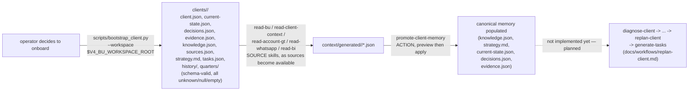

# Workflow: onboarding a new client

Implemented tooling: `scripts/bootstrap_client.py` +
`templates/client/`. Everything after step 1 is `planned` (see
`skills/registry.json`) — this doc says so explicitly rather than
implying a fuller pipeline exists.



## Step 1 — scaffold (implemented)

```bash
python scripts/bootstrap_client.py acme --workspace "$V4_BU_WORKSPACE_ROOT"
```

Every generated file comes verbatim from `templates/client/`
(schema-valid, `unknown`/`null`/`[]`/`{}` only — see CLAUDE.md section 6,
never invented commercial data). Re-running with `--force` only fills in
files that are missing or byte-identical to the template; anything a
human or a previous promotion already customized is left untouched — see
`scripts/bootstrap_client.py`'s docstring and
`tests/skills/` for the protection test.

## Step 2 — feed sources (implemented, per-source)

Run whichever SOURCE skills apply to this client
(`read-bu`, `read-client-context`, `read-account-gt`, `read-whatsapp`,
`read-bi`) as sources become available. Each is read-only — no canonical
memory changes yet.

## Step 3 — promote (implemented)

`promote-client-memory` in `preview` first, `apply` only on explicit
request, per candidate — see `operation/evidence-authority.md`.

## Step 4 — everything downstream of diagnosis (planned)

`diagnose-client`, `calculate-gap`, `identify-priorities`,
`replan-client`, `audit-plan`, `generate-tasks` are not implemented yet
— see `operation/replanning-rules.md` and
`docs/workflows/replan-client.md` for the intended shape once they land.
