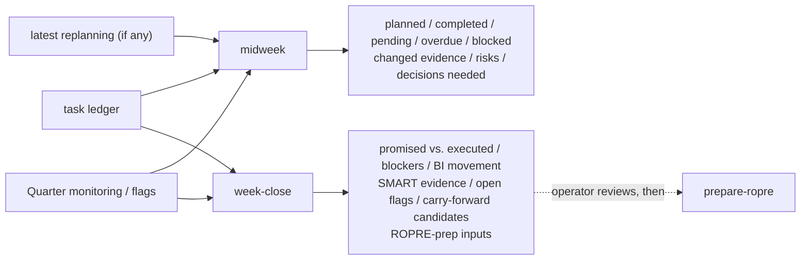

# Midweek and week-close

Two lightweight, read-only INTELLIGENCE skills — no new complex
reasoning, just honest consolidation of what already exists
(`skills/midweek/`, `skills/week-close/`).

## Midweek — "como está a semana até agora"

`week_of` is always the real ISO week (Monday-Sunday) from the system
clock (`scripts/lib/task_ledger_views.py::week_of`). `overdue` is
always derived at read time (`compute_overdue`) — never a persisted
status. Nothing here marks a task completed; it only reads what
`tasks.json` already says.

## Week close — "o que prometemos vs. o que executamos"

`promised` = tasks with `due_at` in the week. `executed` = promised
tasks actually `status: completed`. `not_executed` = promised tasks
still `pending`/`cancelled` by week's end
(`scripts/lib/task_ledger_views.py::partition_week`).
`carry_forward_candidates` is a **list for the operator to review** —
this skill never creates, reschedules, or cancels a task itself
(mission: "NÃO criar carry-over automaticamente").

## Feeding ROPRE without duplicating the task ledger

`week-close`'s `ropre_preparation_inputs` (`results_candidates`,
`next_steps_candidates`) is curated text `prepare-ropre` can use as a
starting point — `prepare-ropre` still reads `tasks.json` directly for
task state; ROPRE never keeps its own copy
(`operation/ropre-rules.md`, "Operating loop connection").
