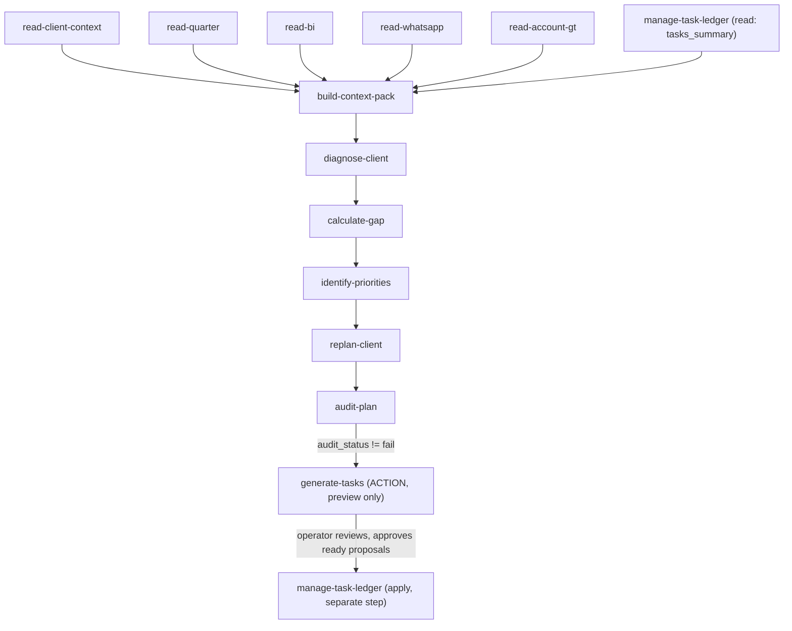

# Workflow: "replaneje `<cliente>`"

Implemented (`skills/registry.json`: `build-context-pack`,
`diagnose-client`, `calculate-gap`, `identify-priorities`,
`replan-client`, `audit-plan`, `generate-tasks` are all
`implemented: true`). `publish-ekyte` remains `planned`. See
`operation/replanning-rules.md` for the full shared policy — this doc
only shows the shape.

Every artifact after `context-pack.json` cites `artifact-ref`s
(content-hash chain, `schemas/artifact-ref.schema.json` +
`scripts/lib/artifact_hash.py`) to the artifacts it was actually
computed from. `scripts/run_replanning_checks.py` validates an on-disk
chain's schemas and cross-artifact invariants
(`scripts/lib/replanning_lint.py`) without reasoning about content —
the reasoning is entirely Claude/Codex executing each `SKILL.md`.

## What each step does (one line each — see the SKILL.md for the real contract)

1. **`build-context-pack`** — consolidates canonical memory + already-run SOURCE outputs for one client/Quarter into `context-pack.json`. Read-only, never diagnoses.
2. **`diagnose-client`** — findings, each explicitly `observed_issue` / `observation` / `hypothesis` / `missing_data` / `risk`. No numeric health score.
3. **`calculate-gap`** — target vs. current, only when both are actually known (`calculable: false` ⇒ `current: null`, never `0`).
4. **`identify-priorities`** — ranks attention using explicit dimensions, never an arbitrary score.
5. **`replan-client`** — workstreams + action proposals. Never mutates `plan.json`.
6. **`audit-plan`** — tries to break the plan before tasks exist. `audit_status: fail` blocks the next step, always.
7. **`generate-tasks`** — turns audit-passed actions into task proposals shaped for `manage-task-ledger`'s `create_task`. Preview only — never writes `tasks.json` itself.

The operator reviews `task-proposals.json`, and only their explicitly-approved `ready` proposals ever reach `manage-task-ledger`'s own `apply` — a separate, later step, not something this pipeline does automatically.

## Output location

`<workspace>/context/generated/<client_id>/replanning/{context-pack,diagnosis,gaps,priorities,replanning,audit,task-proposals}.json`, plus a human-readable `replanning-brief.md`. Gitignored in the workspace, never canonical, never copied into the public engine.

## Synthetic example

`examples/demo-client/acme-demo/intelligence/` has a full, schema-valid, chain-verified run of this pipeline on the 100% fictitious `acme-demo` client — read it before running this against a real client to see the expected shape end to end.

## Not implemented yet

`publish-ekyte` — pushing an approved, applied task to eKyte remains a separate future EXTERNAL action requiring explicit authorization (CLAUDE.md section 20). This pipeline never calls it.
