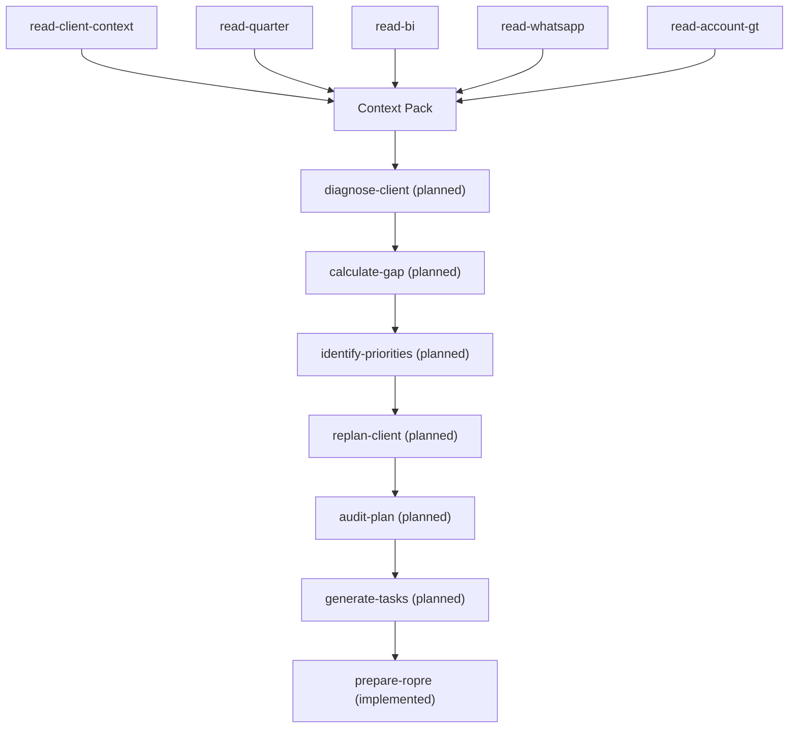

# Workflow: replan-client (target shape — not implemented yet)

**None of the INTELLIGENCE/ACTION skills in this diagram exist yet.**
`skills/registry.json` marks all of them `status: planned`,
`implemented: false`. This document exists so the intended shape is
written down before they're built — see `operation/replanning-rules.md`
for the policy that must govern them once they do, and mission section
25 of the hardening pass that produced this doc for why they were
explicitly deferred.

## Why this is deferred

Building `diagnose-client` through `generate-tasks` well requires actual
diagnostic/prioritization judgment calls that shouldn't be rushed just to
complete a diagram — CLAUDE.md's "no invention" principle applies as
much to *how a diagnosis skill decides what matters* as it does to
metrics and dates. The already-implemented skills
(`read-*`, `promote-client-memory`, `monitor-quarter`,
`manage-task-ledger`, `prepare-ropre`, `close-ropre`) are the trustworthy
foundation this next phase builds on — see `docs/workflows/bi-to-quarter.md`
and `docs/workflows/ropre-cycle.md` for what's real today.

## What "done" looks like for this workflow

Same bar as the rest of this repo: each new skill gets a `SKILL.md`
following `skills/_template/`, an `output.schema.json`, a
`skills/registry.json` entry flipped to `implemented: true`, and tests
under `tests/skills/` for any real logic — not just a prompt that
sounds right.
