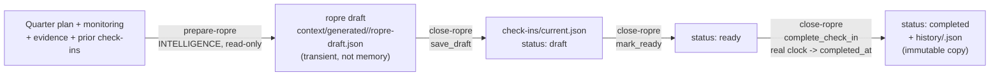

# Workflow: ROPRE cycle

Fully implemented (`prepare-ropre`, `close-ropre`). See
`operation/ropre-rules.md` for the policy summary and the two skills'
`SKILL.md` for the full contract.



## State machine (only forward)

```
absent -> draft -> ready -> completed
```

Any reverse or skipped transition is a conflict, never a write. See
`operation/ropre-rules.md` for why `absent` is a legitimate, intentional
state for a client/Quarter that hasn't had its first real check-in yet —
`scheduled_for` must come from a real meeting, never invented.

## Where next steps go

A `next_step` in a completed check-in can seed a task
(`manage-task-ledger`, `origin.type: "check_in"`) — but only via an
explicit `create_task` call referencing that evidence, never
automatically just because the check-in mentions it.
